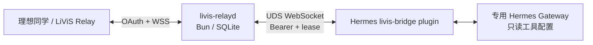

# LiViS 共享 Relay Daemon（一期：Hermes）

[](https://github.com/Jassy930/livis-relay-daemon/actions/workflows/ci.yml)
[](LICENSE)

这是一个独立于 LiViS 官方 OpenClaw 插件、也独立于 Hermes core 的本地 relay daemon。当前协议实现基于对 LiViS v2.0.0 wire 行为的静态观察，把消息可靠地交给专用 Hermes Gateway。

> 当前属于实验性的第三方兼容实现，不是理想或 Hermes 官方组件，也不代表任何官方背书。本仓库不包含或再分发官方 bundle；使用者在连接相关服务前，应自行确认适用的服务条款、协议权限和数据合规要求。

公开仓库不附带可直连生产服务的 live profile，也不默认复用任何官方 OAuth 客户端身份。运行前必须准备自己有权使用的 profile，详见 [`protocol-profiles/README.md`](protocol-profiles/README.md)。



## 一期边界

- 只接 Hermes，不接 AionUI/AionCore。
- 只支持纯文本、单个 final result。
- 只允许预先配置的 LiViS node ID。
- Hermes 必须使用专用 profile、专用工作区和只读工具集。
- 不支持远程审批、附件、token stream、tool progress、管理命令和远程 `/update`。
- 取消语义为 `best_effort`；无法证明工具线程退出时进入 `CancelUnknown` 并隔离 session。

## 可靠性与安全特性

- `(agent, job_id)` 幂等和 payload hash 冲突检测（一期单账号，account 维度固定为本地占位值）。
- SQLite durable outbox；Agent 至多执行一次，ACK/结果至少投递一次。
- `lease_id + run_generation` fencing，同 session 单活。
- cancel/final 使用 CAS 决定唯一赢家；ambiguous execution 不自动重跑。
- Hermes connector 只开放权限 `0600` 的 Unix socket，不监听 TCP。
- LiViS profile 按 SHA-256 固定；未知 wire protocol、版本或 artifact 漂移默认拒绝。
- `login/serve` 要求近期 supported proof；daemon 每 6 小时在线复核。
- Hermes runtime 与 bridge 都必须位于审核版本区间，未知未来版本不会自动放行。

## 开发验证

### 环境要求

- macOS 或 Linux；不支持 Windows。
- Bun 1.3.14+；CI 与锁文件基线为 1.3.14。
- uv 0.11+ 与 Python 3.11–3.13。
- 本地 Hermes 版本须位于配置中的已审核范围。

### 获取与验证

```bash
git clone https://github.com/Jassy930/livis-relay-daemon.git
cd livis-relay-daemon
bun install --frozen-lockfile
bun run check
```

`bun run check` 会依次检查版本、文档链接与 Git tracked files，再执行 TypeScript 类型检查、全部 Bun 测试、`uv lock --check` 和 Hermes plugin pytest。首次初始化仓库时，应先用 `git add` 更新候选 index。

截至 2026-07-18 的本地验收：

- 49 项 Bun 测试通过（含 fake LiViS 端到端、SQLite、UDS connector、Python 跨语言往返、更新/回滚、proof 与公开发布门禁）。
- 19 项 Hermes plugin pytest 通过，真实 Hermes 0.15.1 package import/runtimeVersion smoke 通过。
- 使用本地未纳入版本控制的研究 profile，临时目录 `init → upstream check → doctor` 已通过；该 profile 不随公开仓库分发。
- 状态文件、SQLite、WAL 和 SHM 权限均读回为 `0600`。

本轮没有真实登录、绑定 Agent ID、启动常驻服务或发送 LiViS 消息；这些仍属于部署 canary。

## 使用入口

- [运行手册](docs/OPERATIONS.md)
- [官方升级与回滚](docs/UPSTREAM-UPGRADE.md)
- [版本与发布流程](docs/RELEASING.md)
- [架构与状态所有权](docs/ARCHITECTURE.md)
- [安全边界](docs/SECURITY.md)
- [参与贡献](CONTRIBUTING.md)
- [漏洞报告政策](SECURITY.md)
- [第三方与商标声明](NOTICE.md)

初始化前先审阅安全文档；不要直接执行 LiViS 的 `curl | bash` 安装器来部署本项目。

## 许可证

本项目自主实现的代码采用 [MIT License](LICENSE)。LiViS、理想、Hermes、OpenClaw 等名称、服务、协议和商标不因本项目许可证而获得授权，详见 [NOTICE](NOTICE.md)。
