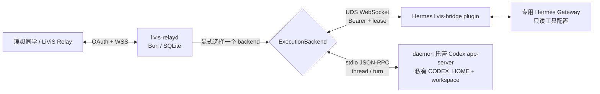

# LiViS 共享 Relay Daemon（一期：Hermes 默认，Codex 实验后端）

[](https://github.com/Jassy930/livis-relay-daemon/actions/workflows/ci.yml)
[](LICENSE)

这是一个独立于 LiViS 官方 OpenClaw 插件、Hermes core 与 Codex 的本地 relay daemon。当前协议实现基于对 LiViS v2.0.0 wire 行为的静态观察，由 daemon 持有消息、执行租约和 durable outbox，再把请求交给默认 Hermes backend 或显式启用的实验性 Codex app-server backend；Codex 默认连接 OpenAI，也可显式选择一个兼容 Responses wire 的 custom provider。服务端事实、历史 canary 与未知项以[协议证据边界](docs/LIVIS-RELAY-PROTOCOL-BOUNDARY.md)为准。

> 当前属于实验性的第三方兼容实现，不是理想、Hermes、Codex 或 OpenAI 官方组件，也不代表任何官方背书。本仓库不包含或再分发官方 bundle；使用者在连接相关服务前，应自行确认适用的服务条款、协议权限和数据合规要求。

公开仓库不附带可直连生产服务的 live profile，也不默认复用任何官方 OAuth 客户端身份。运行前必须准备自己有权使用的 profile，详见 [`protocol-profiles/README.md`](protocol-profiles/README.md)。



## 一期边界

- 默认只接 Hermes；Codex 必须显式配置并确认远程执行，Claude Code 尚未实现。
- 只支持纯文本、单个 final result。
- 一期暂将 LiViS `node_id` 视为设备来源标识；每套 daemon、config 与 state directory 只允许一个预先配置的 `node_id`。
- 不支持多设备同时接入、跨设备共享后端会话或原地换设备；稳定 session key 固定为 `livis:<agentId>`。
- Hermes 必须使用专用 profile、专用工作区和只读工具集；Codex 必须使用 state directory 内的专用 `CODEX_HOME`、API key 凭据和 workspace，OAuth/ChatGPT 与 Bedrock 账号不属于支持范围。Codex 只能使用默认 OpenAI 或显式 custom Responses provider；custom endpoint 是 API key、prompt、会话上下文与工具结果的数据出口，必须由操作者单独确认。
- 不支持远程审批、附件、token stream、tool progress、管理命令和远程 `/update`。
- 取消语义为 `best_effort`；无法证明工具线程退出时进入 `CancelUnknown` 并隔离 session。

## 可靠性与安全特性

- `(agent, job_id)` 幂等和 payload hash 冲突检测（一期单账号，account 维度固定为本地占位值）。
- SQLite durable outbox；Agent 至多执行一次，ACK/结果至少投递一次。
- `lease_id + run_generation` fencing，同 session 单活。
- cancel/final 使用 CAS 决定唯一赢家；ambiguous execution 不自动重跑。
- Hermes connector 只开放权限 `0600` 的 Unix socket，不监听 TCP。
- `execution.backend` 固定为 Hermes/Codex/Claude 三选一；Claude 尚未实现并在 `doctor`/`serve` 失败关闭，不会回退到其他 backend。
- Codex 由 daemon 通过 stdio app-server 直接管理；当前 JobStore schema v7 以数据库 trigger 强制 `jobs.target_backend` 不可变，在 v6 的账号、模型、安全配置与 thread-tail checkpoint 之上新增 append-only execution attempt 账本。`jobs/outbox` 仍是业务状态真源，`backend_sessions` 只保存可变的当前 session 与恢复锚点。
- Codex 生产启动、idle recovery 与 dispatch 只接受 `account.type=apiKey`；每次 dispatch 都会在 `turn/start` 前重新回读账号并与内存/SQLite 锚点核对。空账号、ChatGPT/OAuth、Bedrock、未知账号类型或运行中认证模式漂移都不能创建、恢复或执行生产 thread。无账号零模型 smoke 是不进入生产 backend 的协议诊断例外。
- Codex model provider 与 API key 都属于 state directory 的不可变安全边界。同一 `stateDir` 不允许从 OpenAI 切到 custom、在 custom 端点之间切换或轮换 key；这些变化必须使用全新 `stateDir` 和全新专用 `CODEX_HOME`，`session release` 不是 provider/key 切换工具。
- 切换 backend 前必须先用原 backend 排空其 `Received/Acked/Dispatching/Running/Cancelling` 积压；`serve` 会在启动 backend 或 Relay 前拒绝异 backend 非终态 job，`doctor` 的 `execution_backend_backlog` 与 `status.backendBacklog/recentJobs[].latestAttempt` 提供本地观测。终态历史不会阻止切换，未完成的 outbox 投递仍独立恢复。
- Codex 只在完整 turn deadline 内的 terminal `turn/completed` 后返回一个 agent final；超时先请求 interrupt，再按固定 grace 失败关闭。工具网络关闭、workspace 是唯一可写根，审批请求默认拒绝。
- Codex app-server 使用 workspace 外的宿主 HOME/TMPDIR，agent 使用 workspace 内独立 HOME/TMPDIR；关闭时按独立 POSIX 进程组执行 `SIGTERM → SIGKILL → 收口确认`。
- Codex app-server 只在无内存/SQLite active attempt、无 recovery/quarantine 且持久 Store anchor 未漂移的 idle 状态自动恢复；daemon 生命周期累计最多按 `250/1000/5000 ms` 尝试三次，只恢复并回读同一 thread。活动 turn 期间退出仍失败关闭并要求人工处置，绝不自动重放。
- LiViS profile 按 SHA-256 固定；未知 wire protocol、版本或 artifact 漂移默认拒绝。
- `login/serve` 要求近期 supported proof；daemon 每 6 小时在线复核。
- `wireContractRevision + credentialMode` 同时绑定 profile、runtime digest 与 supported proof；机器可读 registry、append-only 历史门禁和本地脱敏 probe artifact 防止 wire 代码静默漂移或覆写旧基线。
- schema v1→v2 迁移采用固定 contract 人工确认、私有 PREPARED/备份、source→target 重建校验、持久化 guard、proof quarantine 和可自愈显式回滚；迁移命令不打开 SQLite。
- Hermes runtime/bridge 与 Codex CLI 都必须位于各自审核版本区间；Codex 当前固定为 `[0.145.0, 0.146.0)`，未知未来版本不会自动放行。

## 开发验证

### 环境要求

- macOS 或 Linux；不支持 Windows。
- Bun 1.3.14+；CI 与锁文件基线为 1.3.14。
- uv 0.11+ 与 Python 3.11–3.13。
- 使用 Hermes 时，本地 Hermes 版本须位于配置中的已审核范围。
- 使用 Codex 时，Codex CLI 必须位于 `[0.145.0, 0.146.0)`，并通过标准输入为 daemon 专用 `CODEX_HOME` 单独写入 API key 登录凭据。

### 开发环境快速准备

Bun 是本项目使用的 JavaScript/TypeScript 运行时和包管理器，uv 用来管理 Hermes plugin 的 Python 环境。请先从 [Git](https://git-scm.com/downloads)、[Bun](https://bun.sh/docs/installation) 和 [uv](https://docs.astral.sh/uv/getting-started/installation/) 官方安装说明准备这三个工具；项目不提供下载后立即执行的远程安装脚本。

以下命令仅适用于已经安装 Homebrew 的 macOS；没有 Homebrew 或使用 Linux 时，请按上述官方说明分别安装 Git、Bun 和 uv：

```bash
brew install git oven-sh/bun/bun uv
```

确认 `git --version`、`bun --version` 和 `uv --version` 均能正常输出后，复制下面整行即可克隆仓库、按锁文件安装依赖并运行完整自检：

```bash
git clone https://github.com/Jassy930/livis-relay-daemon.git && cd livis-relay-daemon && bun install --frozen-lockfile && (cd hermes-plugin && uv sync --frozen) && bun run check
```

这条命令只准备开发环境，不会安装常驻服务，也不会生成连接生产服务所需的 live profile。后续配置步骤见[运行手册](docs/OPERATIONS.md)。

`bun run check` 会依次检查版本、文档链接、Git tracked files、wire contract append-only 历史与本地 S2 protocol probe artifact，再执行 TypeScript 类型检查、全部 Bun 测试、`uv lock --check` 和 Hermes plugin pytest。其中公开发布与 append-only 门禁审核 Git index；probe generator、类型检查和测试读取当前工作区。运行前应先用 `git add` 精确暂存候选文件，并保持 staged/worktree 一致。

验证结果必须绑定精确提交，不能沿用 README 中的固定测试数量或旧 canary 结论。当前候选应在精确 staged tree 上运行 `bun run check`；实际测试数量以该次输出为准。

2026-07-18 曾在旧代码基线上留下 Hermes 0.15.1 前台纯文本闭环的高层人工摘要；同期 LaunchAgent 记录也只证明服务存活、online doctor、Relay handshake 与 connector ready。它们都早于后续 protocol profile v2、单设备边界、Relay 资源门禁和 JobStore v3，更早于当前 JobStore v7，且没有绑定当前最终提交的完整 receipt，因此只作历史参考，不能证明当前版本或 launchd 常驻消息闭环已经通过。证据边界和当前验收步骤见 [`docs/HERMES-CANARY.md`](docs/HERMES-CANARY.md)。

Codex 0.145.0 的真实非临时、零模型 turn canary 已在 macOS 命中 workspace-only、
凭据/宿主 HOME 读写拒绝、workspace 外同卷牺牲文件 hardlink 拒绝、command identity、
系统 `nc -O` 原始 `connect` 的精确 `EPERM` 和审批关闭边界，并恢复同一零 turn thread。
daemon 还会流式绑定 command 内容摘要与文件身份，并在启动、恢复和持久 session 间失败
关闭。2026-07-23 早先的 API-key 单 turn 例外 canary 取得一次 turn 提交及 provider
`401 invalid_api_key` 拒绝证据，并暴露 0.145.0 legacy `thread/read` 把 failed tail
投影成 completed 的兼容缺口。提交 `65f00c1` 上的后续全新单 turn canary 误选了本机非默认
凭据副本；app-server 运行态将其识别为 `account_type=chatgpt`，不属于项目支持的 API-key
路径。provider 仍以 structured `unauthorized` 拒绝，但修复已把
job 原子收口为 `Failed`、`Pending` outbox、`reserved → accepted → failed`、active clear、
`recovery_required=false` 和单条凭据 quarantine，没有 assistant、工具或 token-count 记录。
这只验证通用失败结算修复，不是 API-key 凭据 canary 或成功模型 turn；当前代码会在创建
thread 前拒绝同类非 API-key 账号。随后在精确提交 `56a1d77` 上，以全新 state directory、
标准输入登录的隔离 API key、显式 custom Responses provider 和固定模型完成了一个成功
single turn：固定回复匹配，job 为 `Succeeded`，ledger 为
`reserved → accepted → succeeded`，checkpoint 为 `completed/1`，无工具事件、无
quarantine、无 active/recovery 残留，临时凭据已删除且其余 state 普通文件未命中该 API key。
这把 API-key/custom 模型路径升级为当前 macOS/Codex 0.145.0 组合下的功能 canary GO；它
仍不证明 endpoint 内部 HTTP 次数、请求层硬禁用工具、Linux/cgroup、资源配额或
`Delivered → App 回显`。因此 Codex 仍是 Draft/受控开发功能，不应宣称生产上线，完整门禁见
[`docs/CODEX-APPSERVER.md`](docs/CODEX-APPSERVER.md)。

仓库提供 Relay LaunchAgent 模板、Hermes 双服务运行手册和 Codex 单服务边界，但安装、加载、启停与真实消息 canary 都是操作者在获授权环境中的显式步骤；合并文档或 `plutil -lint` 通过不代表用户服务已被修改，也不代表 LiViS 消息已完成 `Succeeded → Delivered → App 回显` 闭环。

## 使用入口

- [LiViS 服务端协议证据与支持边界](docs/LIVIS-RELAY-PROTOCOL-BOUNDARY.md)
- [本地协议探针](docs/PROTOCOL-PROBES.md)
- [运行手册](docs/OPERATIONS.md)
- [Codex app-server 执行后端](docs/CODEX-APPSERVER.md)
- [Hermes 实网 canary](docs/HERMES-CANARY.md)
- [官方升级与回滚](docs/UPSTREAM-UPGRADE.md)
- [普通 profile 激活事务](docs/PROFILE-ACTIVATION.md)
- [版本与发布流程](docs/RELEASING.md)
- [架构与状态所有权](docs/ARCHITECTURE.md)
- [安全边界](docs/SECURITY.md)
- [参与贡献](CONTRIBUTING.md)
- [漏洞报告政策](SECURITY.md)
- [第三方与商标声明](NOTICE.md)

初始化前先审阅安全文档；不要直接执行 LiViS 的 `curl | bash` 安装器来部署本项目。

## 许可证

本项目自主实现的代码采用 [MIT License](LICENSE)。LiViS、理想、Hermes、Codex、OpenAI、OpenClaw 等名称、服务、协议和商标不因本项目许可证而获得授权，详见 [NOTICE](NOTICE.md)。
