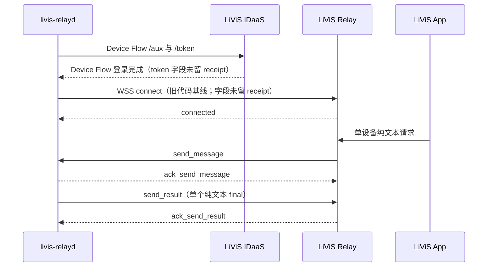

# LiViS 服务端协议证据与支持边界

本文是本项目对 LiViS IDaaS / Relay 服务端协议断言的唯一证据入口。它不是厂商官方规范，也不把客户端实现、fake Relay 或工程推断升级为服务端事实。

最后核对日期：2026-07-21。

## 1. 真源与裁决规则

协议相关事实按以下顺序组合使用：

1. 本文记录“知道什么、凭什么知道、还不知道什么”；
2. 私有 protocol profile 固定获授权端点、OAuth 参数、wire identity、timing 与官方 artifact 哈希；
3. `src/protocol/livis.ts` 和 `src/relay/client.ts` 是当前 daemon 的实际序列化与状态机实现；
4. fake Relay、golden fixture 与单元测试只证明本项目内部契约；
5. 脱敏的真实 canary 记录只证明精确版本组合在特定时间和环境中被服务端接受。

出现冲突时，不按“更像官方”猜测：降低证据等级、标为未知并失败关闭。以下表述是强制约束：

- “官方客户端发送了字段”不等于“服务端要求该字段”；
- “fake Relay 接受了帧”不等于“真实 Relay 兼容”；
- “真实 Relay 接受了一次”不等于字段必填、长期稳定或未来版本兼容；
- “公开检索没有找到规范”不等于服务端没有内部规范；
- 没有最终 head 的真实 canary 时，不得把 wire 变化描述为已兼容。

## 2. 证据等级

| 等级 | 证据 | 可以证明 | 不能证明 |
|---|---|---|---|
| S5 | 服务端正式 schema、版本化公开协议，或绑定明确版本/构建并可留存审计的书面负责人确认 | 对应版本的规范性要求 | 未覆盖版本或部署环境 |
| S4 | 获授权真实 IDaaS / Relay canary，绑定精确版本元组 | 服务端在该次测试中接受或拒绝了该序列 | 字段必填性、未来兼容、所有错误路径 |
| S3 | 经哈希固定的官方客户端 artifact 静态观察 | 官方客户端生成或处理了什么 | 服务端是否要求、忽略或禁止该行为 |
| S2 | fake Relay、fixture、CI、单元或集成测试 | daemon 内部生成、解析和状态转换符合预期 | 真实服务端行为 |
| S1 | 代码审计、协议常识或工程推断 | 候选解释、风险和待验证假设 | 服务端事实 |
| U | 没有可核验证据 | 只能登记问题 | 任何兼容性结论 |

IDaaS 的标准语义可同时引用公开 RFC：Device Authorization Grant 参考 [RFC 8628](https://www.rfc-editor.org/rfc/rfc8628)，refresh-token grant 参考 [RFC 6749](https://www.rfc-editor.org/rfc/rfc6749)，token revocation 参考 [RFC 7009](https://www.rfc-editor.org/rfc/rfc7009)。RFC 只能约束标准 OAuth 语义，不能替代 LiViS 私有端点和 Relay wire 的服务端证据。

截至核对日期，本项目未持有 S5 级 LiViS Relay 服务端 schema、公开 SDK 或稳定协议承诺。

### 公开检索记录

2026-07-21 只读检索范围如下：

| 渠道 | 查询 | 结果 | 限制 |
|---|---|---|---|
| GitHub code search | `"token_expiring" "token_refreshed"` | 0 | 索引未返回本仓库已知代码，阴性不可靠 |
| GitHub code search | `"ack_send_result" "from_node_id"` | 0 | 可能遗漏私有仓库、未索引提交和非 GitHub 资料 |
| GitHub code search | `LiViS relay websocket protocol` | 0 | 自然语言命名可能不同 |
| 聚焦公开网页检索 | `"LiViS" "token_expiring" relay protocol` | 无结果 | 不覆盖登录后页面、内部文档和未被搜索引擎收录的资料 |

因此只能写“在上述范围内查无公开证据”，不能写“服务端没有协议”或据此推断字段可选。

## 3. 兼容性版本元组

今后每份可作为合并门禁的 S4 canary 必须绑定：

```text
daemon commit
+ protocol profile ID / SHA-256
+ official client artifact version / SHA-256
+ Relay 环境或构建标识（无法取得时显式写 unknown）
+ Hermes runtime / bridge / connector protocol（涉及端到端时）
+ canary 时间、步骤和脱敏结果
```

任一项变化都使旧证据降级为历史参考。重基、冲突解决或组合其他 PR 后，旧 head 的 CI 和 canary 不能自动继承。

公开账本只保留 commit、版本、时间、脱敏结果与不透明 receipt ID。profile/artifact 哈希、环境标识和脱敏字段集应保存在获授权的私有审计位置；token 值、生产端点、账号、Agent/node ID、业务正文和未脱敏原始帧不得进入 PR、Issue 或 Git。若无法留下可定位 receipt，该 canary 只能作为历史人工摘要，不能作为未来字段级兼容证明。

当前最高等级历史证据来自 [PR #14](https://github.com/Jassy930/livis-relay-daemon/pull/14)，它是高层端到端 S4 人工摘要，不是满足上述新标准的字段级 receipt：

- 日期：2026-07-18；
- daemon：0.1.0；PR head `d2c4df1`，合入基线 `708b857`；
- LiViS：经在线 supported proof 确认的私有 v2.0.0 profile；完整 profile SHA、端点和身份不公开；
- Hermes：0.15.1；bridge：0.1.0；connector protocol：v1；
- 拓扑：单一来源 `node_id`、隔离 Hermes profile、前台进程、纯文本与单 final；
- Relay 服务端构建标识：未记录，视为 `unknown`；
- receipt：没有记录可定位的不透明 receipt、原始字段集或私有保管位置，公开 provenance 不完整。

当前 `main` 已晚于该基线；仓库没有记录基于当前最终 head 的新 S4 canary。

截至 2026-07-21 的历史证据矩阵：

| 记录 | 最高等级 | 实际证明 | 明确不证明 | 当前状态 |
|---|---|---|---|---|
| #14 | 高层 S4 人工摘要 | 旧版本 Device Flow、握手、单设备纯文本、Hermes final 与 outbox Delivered | 原始字段必填性、在线刷新、取消、重连、常驻运行 | 已合并；旧基线 |
| #17 | 局部 S4 | macOS LaunchAgent、online doctor、Relay handshake、connector ready | 同一常驻 job 的消息与结果闭环 | Draft / DIRTY；旧 head CI |
| #23 | S3 + S2 | 官方客户端静态字段与 access-token-only fake Relay | 真实 Relay 省略 refresh token | Draft / DIRTY；旧 head CI |
| #24 | S3 + S2 | 在线刷新 generation/退避的代码和 fake Relay | 真实 `token_expiring/token_refreshed` 与重连 | Draft / DIRTY；旧 head CI |
| #28 | LiViS 侧 S2 | 真实 Hermes 0.18.2 runtime 配合 fake UDS 的局部生命周期 | LiViS IDaaS / Relay、真实模型和完整 profile | Draft / DIRTY；旧 head CI |

CI、`.test` fixture、`.invalid` example、合成 artifact 和 GitHub workflow canary 都不是服务端 canary。

## 4. 已验证的最小序列



该图只表示公开记录支持的高层路径，不是原始帧 trace。App 最终展示、字段全集和 refresh grant 没有独立 receipt，不列为 S4 字段事实。

2026-07-18 的 S4 证据实际确认：

- Device Flow 在真实 IDaaS 上完成；`authorization_pending` 实际返回 HTTP 428，daemon 按 OAuth `error` 继续轮询；
- 旧代码路径完成 Relay 握手；公开记录没有单独保存 refresh grant 或 `connect` 原始字段 receipt；
- `/sethome` 与后续普通纯文本 job 均进入 `Succeeded`；
- 普通文本由真实 Hermes 模型处理，结果进入 durable outbox；
- daemon 收到真实 `ack_send_result`，outbox 进入 `Delivered`；
- SQLite integrity、supported proof、Relay handshake、connector ready 与唯一双侧 allowlist 同时通过。

这次 canary 没有验证 launchd/systemd 常驻、取消、重复或迟到投递、断网重连、在线 token refresh、多设备、未来版本或长期稳定性。

## 5. IDaaS 协议账本

| 操作 | daemon 发送 / 接收 | 当前证据 | 服务端边界 |
|---|---|---|---|
| Device code | `POST /aux`：`client_id`、`scope + offline_access`、`audience`、`offline_access=true`；接收 `device_code`、`verification_uri_complete`、`expires_in`、`interval` | S4 完成真实 Device Flow；S2 只覆盖已登记成功形状和部分必需字段存在性 | 字段类型、取值范围、URI scheme、私有路径和服务端必填性尚无完整负向验证或 S5 schema |
| Device token polling | `POST /token`：device-code grant、`device_code`、`client_id` | S4 观察到 `authorization_pending` + HTTP 428 并最终成功；S2 覆盖标准 HTTP 400 和 `slow_down` | HTTP 400/429 分支不是实网证据；以 OAuth `error` 而非状态码裁决 |
| Access-token refresh | `POST /token`：refresh-token grant、`refresh_token`、`client_id`；接收 access token，可选轮换 refresh token | S2 覆盖成功、轮换、`invalid_grant` 等分支；当前代码路径暗示历史握手前可能经过该步骤，只能记为 S1 推断 | 没有独立真实 HTTP receipt；响应字段、轮换细节、所有错误状态和在线长期行为未知 |
| Revoke | `POST /revoke`：token、`token_type_hint=refresh_token`、`client_id` | S2 代码与测试 | 当前没有真实 2xx、网络失败或拒绝 canary |

IDaaS token 响应可能直接包含 token 字段，也可能在 audience 键下嵌套；这是 S3/S2 兼容行为，不代表服务端公开承诺两种形状。

## 6. Relay 消息账本

“字段”列描述当前 daemon 使用的形状，不声明未列字段一定非法。

| 方向 | 消息 | 当前关键字段 / 行为 | 证据 | 服务端必填性与状态 |
|---|---|---|---|---|
| daemon → Relay | WSS URL | query `protocol_version=1`，TLS profile 使用 `wss` | S4 高层握手；参数形状为 S3/S2，无原始 receipt | 参数必填性未知 |
| daemon → Relay | `connect` | metadata：`msg_id/job_id/agent_id/timestamp`；payload：`device_id/node_name/node_desc/client/token/refresh_token` | S4 高层握手 + S3/S2 帧形；没有字段级 receipt | `refresh_token` 是否必填或可省略为 U；access-token-only 仍是候选契约 |
| Relay → daemon | `connected` | 当前只要求 `type`；其余字段不参与握手 | S4 实际收到 | 服务端完整 schema 未知 |
| Relay → daemon | `send_message` | metadata `job_id` 必需；payload `from_node_id`、`data.type=exec`、非空 `data.content` 必需；`data` 可为对象或 JSON 字符串 | S4 单设备纯文本；S2 负向校验 | `msg_id/timestamp/from_node_type` 的服务端保证与最大长度未知 |
| daemon → Relay | `ack_send_message` | metadata 含 job/agent/device/message/timestamp；payload 增加 `nodeType`，metadata 增加 `client` | S4 路径中实际发送；S2 | Relay 是否要求所有字段、如何去重未知 |
| Relay → daemon | `cancel_chat` | 当前只读取 metadata `job_id` | S3/S2；无 S4 | 来源 node 缺失；字段、重放和鉴权语义未知 |
| daemon → Relay | `ack_cancel_chat` | 与普通 ACK 相同的 identity 字段 | S3/S2；无 S4 | 服务端要求未知 |
| daemon → Relay | `send_result` | metadata 含 `job_id`、每次投递 `msg_id`、agent/device/timestamp；payload `data` 为 JSON 字符串 `{"text":"..."}` | S4 纯文本结果被接受并 ACK；S2 重试 | 服务端幂等键、重复展示和大小上限未知 |
| Relay → daemon | `ack_send_result` | daemon 按 `payload.ref_msg_id`、`metadata.job_id`、`metadata.msg_id` 顺序尝试关联 | S4 至少一种形状完成 Delivered；S3/S2 覆盖候选顺序 | 实际 canary 使用的字段未脱敏记录；服务端优先级未知 |
| daemon → Relay | `heartbeat` + WS ping | application heartbeat 携带 identity；同时发送 WebSocket ping | S3/S2；无独立 S4 记录 | Relay 是否要求 heartbeat、是否回 pong 未确认；daemon 将任一可解析服务端消息视为存活证据 |
| Relay → daemon | `token_expiring` | 触发本地 IDaaS refresh | S3/S2；无 S4 | 触发时机、重复语义未知 |
| daemon → Relay | `token_refresh` | 当前 main 发送新 access token 和 refresh token | S3/S2；无 S4 在线刷新 | refresh token 必填性为 U；只发 access token 的候选尚未验证 |
| Relay → daemon | `token_refreshed` | 清除本地刷新 ACK timer / failure count | S3/S2；无 S4 | ACK 字段和错误响应未知 |

未知 `type` 在握手后会被记录并忽略；格式错误会被当前消息链拒绝，但不会因此推断服务端应有相同行为。

## 7. 凭据与权限边界

当前兼容事实和目标安全策略必须分开记录：

| 流向 | 当前 main | 证据 / 决策 |
|---|---|---|
| SecretStore → IDaaS `/token` / `/revoke` | 允许 | OAuth 所需；refresh token 只在本地持久化 |
| access token → Relay `connect` / `token_refresh` | 允许 | 短期 bearer 凭据；S4 只确认初始 `connect` |
| refresh token → Relay `connect` | 当前兼容基线会发送 | 历史 S4 高层握手发生在该代码基线，但没有字段级 receipt；S3/S2 证明客户端发送。这是显式安全例外，不是目标稳态 |
| refresh token → Relay `token_refresh` | 当前实现会发送 | 只有 S3/S2；尚无 S4 在线刷新证据 |
| refresh token → SQLite、argv、普通日志、Git | 禁止 | 项目安全策略与发布门禁 |

目标安全边界是 Relay 只接收短期 access token，但在真实 Relay 完成 `connect → connected` 和 `token_expiring → token_refresh → token_refreshed` canary 前，它只能标为候选契约。若服务端确实要求长期凭据，项目必须暂停并做服务端/凭据协议决策；不得以“兼容回退”为名静默重新发送 refresh token。

## 8. 本项目支持边界

以下是 daemon 的产品与安全承诺，不是 LiViS 服务端保证：

- 一套 daemon、config、state directory 和专用 Hermes profile 只绑定一个获准 `from_node_id`；该值只是来源标识，不是账号 subject 或密码学设备证明；
- 只接受 `send_message` 中 `data.type=exec` 的非空纯文本；只向远端产生一个不同的纯文本 final；
- 不支持附件、流式 token、tool progress、中间消息、远程审批、管理命令、多设备或跨设备 session；
- job 执行目标为至多一次，ACK 与结果投递目标为至少一次；重复结果需要 Relay 消费方幂等；
- `cancel_chat` 是 best effort，无法证明执行线程退出时进入 `CancelUnknown` 并隔离 session；
- malformed、越界输入、未知 protocol/profile/artifact 默认拒绝或失败关闭；
- 服务器未记录或未验证的行为不能由客户端 artifact、类型定义或测试名称补齐。

## 9. 协议影响 PR 的准入门禁

触及以下任一项即视为 wire 变化：`src/protocol/**`、IDaaS 表单、Relay URL/query、帧方向或字段、凭据流向、握手、ACK 关联、heartbeat、在线刷新、取消、重试时序或服务端可观察状态。

| 变化类型 | 最低门禁 |
|---|---|
| 不改变 wire 的纯内部实现 | 单元/集成测试、`bun run check`；若影响 ACK/重试时序，仍需按 wire 变化处理 |
| 帧形、事件序列、时序、错误行为和凭据流向均不变的纯内部重构 | strict fake Relay、golden frame diff、最新 main 组合测试 |
| 新增/删除/改名字段，改变方向、顺序、认证或 ACK 语义 | 本文对应行更新 + strict fake Relay 正反例 + 最终 head 的获授权真实 Relay canary |
| 扩大 secret、命令或设备权限面 | 独立安全评审 + 明示用户批准 + 真实 canary；不得自动兼容回退 |

wire 变化转 Ready 前必须同时满足：

1. PR 描述声明证据等级、未知项和失败表现；
2. 本文和 protocol profile / fixture 同步更新；
3. fake Relay 严格校验必需与禁止字段，而不是无条件返回成功；
4. 在精确最终 head 上记录 `connect → connected`、业务消息/结果 ACK，以及被改动的专项序列；
5. 原始帧仅在授权隔离环境检查，公开证据不得包含 token、端点、账号、Agent ID、node ID 或业务正文；
6. `bun run check` 与全部 required CI 基于同一 head 全绿；
7. 重基、冲突解决、组合其他 wire PR 或 profile/runtime 变化后重新验证；
8. 找不到服务端证据时保持 Draft，不以推断投票决定兼容性。

当前 `runtimeContractSha256()` 固定 profile 参数，但没有覆盖 daemon 生成帧的代码语义。必须建立独立的 `wireContractRevision`（凭据模式也必须进入该 revision），并将它绑定到 protocol profile、runtime digest、supported proof、status 与 canary receipt。在该代码门禁合入前，任何 wire 代码变化都不得转 Ready；仅在文字上声明“人工失效旧 proof”不构成可执行门禁。

## 10. 当前 PR 裁决

### #23：access-token-only 候选

#23 保持 Draft。转 Ready 前必须同时满足：

1. 基于最新 `main` 形成最终组合 head，并保留 #20 的 revoke 语义；
2. 先合入并使用上述 `wireContractRevision + credentialMode` 代码门禁；
3. strict fake Relay 对 `connect` 与 `token_refresh` 同时断言只有 access token，并拒绝 refresh token；
4. 在同一最终 head 完成 `connect(access-only) → connected`；
5. 完成 `token_expiring → 本地 IDaaS refresh → token_refresh(access-only) → token_refreshed`；
6. 刷新后再完成一条纯文本消息/结果 ACK，并验证断线重连；
7. 公开 receipt 只记录字段名、credential mode、版本元组和脱敏结果，证明两类 Relay 帧都没有 refresh token；
8. 服务端不兼容时保持失败关闭，不恢复发送长期凭据。

#24 只能在 #23 的 access-token-only 与 wire revision 基线上移植 generation / 有限退避逻辑，不能独立合入或重新带回 refresh token。

## 11. 当前未知项与扩展 canary backlog

优先级从高到低：

1. `connect` 与 `token_refresh` 中 `refresh_token` 的服务端必填性；
2. `token_expiring → token_refresh → token_refreshed` 的真实时序、轮换与错误响应；
3. 断线重连后 access token、outbox 与 ACK 的组合行为；
4. `ack_send_result` 的实际关联字段、重复结果去重和迟到 ACK；
5. `cancel_chat/ack_cancel_chat` 的字段、重放、来源身份和服务端状态；
6. application heartbeat 与 WebSocket pong 的服务端要求；
7. `from_node_id` 的稳定性、轮换、账号绑定和认证强度；
8. 帧大小、速率限制、顺序保证、错误帧 schema 与服务端构建版本。

除 #23 专项门禁外，后续获授权隔离 canary backlog 包括：

```text
单一 node 的纯文本 send_message / ack_send_message
→ Hermes final / send_result / ack_send_result
→ ACK 丢失与迟到 ACK
→ cancel_chat / ack_cancel_chat / CancelUnknown
```

canary 完成后，只更新实际观察到的行；没有执行的步骤继续保留为未知。
